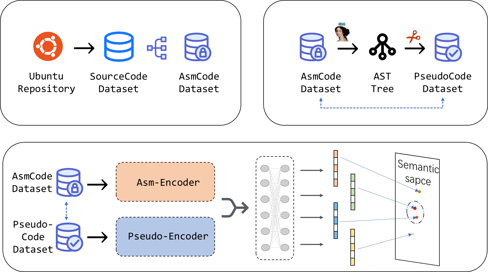

### DBFCoder

DBFCoder (Deobfuscate Encoder) is designed to enhance the resilience of sequence-based binary code similarity models against obfuscation. The model takes assembly language and pseudocode of binary code as inputs, extracts semantic information of binary functions at different levels through an assembly encoder and a pseudocode encoder, and then integrates these pieces of information into a unified semantic embedding through a fusion module. While converting binary code into semantic embeddings, the model maps them into a high-dimensional semantic space where functions with similar semantics are mapped closely together, and those with different semantics are farther apart. The degree of similarity between functions can be easily determined by calculating the distance between embeddings.



### step1 Build obfuscated binaries.

Use Binkit to compile the obfuscated dataset according to [obfus.yml](assets/obfus.yml) [projects.txt](assets/projects.txt)

```
(docker) $ python gnu_compile_script.py \
    --base_dir "/BinKit/Datasets/Deobfuscate/dataset" \
    --num_jobs 112 \
    --whitelist "/BinKit/Datasets/Deobfuscate/projects.txt" \
    --download
(docker) $ python gnu_compile_script.py \
    --num_jobs 112 \
    --base_dir /BinKit/Datastes/Deobfuscate/dataset/ \
    --config /BinKit/Datastes/Deobfuscate/obfus.yml \
    --whitelist /BinKit/Datastes/Deobfuscate/projects.txt
```
BCSD needs to be performed on stripped binary files, but aligning binary files requires symbols.
```
$ find path/to/datasets -type f -executable \
| parallel strip {} -o {}.stripped
```

### step2 Extract features.
Use scripts in the idascripts folder to extract assembly instructions and pseudocode from ELF files

set `TARGET_DIR = "path/to/dataset"`
```
(win) D:\software\IDA_Pro_7.7> python launcher.py
```

tips: Configuring the hexrays.cfg file in IDA can disable automatic comment generation and prevent local variables from expanding, improving data collection quality.
```
git diff a\IDA_Pro_7.7\cfg\hexrays.cfg b\IDA_Pro_7.7\cfg\hexrays.cfg
...
 // Collapse local variables declarations by default
-COLLAPSE_LVARS            = YES
+COLLAPSE_LVARS            = NO

-HEXOPTIONS               = 0x831fd      // Combination of HO_... bits
-// HEXOPTIONS               = 0x831FF      // Combination of HO_... bits
+HEXOPTIONS               = 0x831FF      // Combination of HO_... bits
```

### step3 Process dataset.
set `TOP = "path/to/datasets"`
```
$ python processDataset.py
```
After processing, statistical information will be generated:
- summary/sum.log
- summary/project.sum.log
- summary/file.sum.log
- summary/function.sum.log

### step4 Train DBFCoder.
```
$ wandb login
$ WANDB_MODE=online CUDA_VISIBLE_DEVICES=7 python train.py
```

### step5 Experiment.

- lab1: One-to-one binary code diff
- lab2: One-to-many binary code search

```
$ CUDA_VISIBLE_DEVICES=6 bash lab1.sh model/save/best_model.pt
$ CUDA_VISIBLE_DEVICES=5 bash lab2.sh model/save/best_model.pt
$ python computeMetrics.py
```
- lab1 AUC value

|    | O0 | O1         | O2                                                              | O3                                                              | sub        | bcf                                                                   | fla                                                                   | all                                                                   |
|----|----|------------|-----------------------------------------------------------------|-----------------------------------------------------------------|------------|-----------------------------------------------------------------------|-----------------------------------------------------------------------|-----------------------------------------------------------------------|
| O0 |    | [0.9984](experiment/images/lab1_clang-4.0-O0VSclang-4.0-O1.png) | [0.9926](experiment/images/lab1_clang-4.0-O0VSclang-4.0-O2.png) | [0.9985](experiment/images/lab1_clang-4.0-O0VSclang-4.0-O3.png) | [0.9997](experiment/images/lab1_clang-4.0-O0VSclang-obfus-sub-O0.png) | [0.9918](experiment/images/lab1_clang-4.0-O0VSclang-obfus-bcf-O0.png) | [0.9924](experiment/images/lab1_clang-4.0-O0VSclang-obfus-fla-O0.png) | [0.9719](experiment/images/lab1_clang-4.0-O0VSclang-obfus-all-O0.png) |
| O1 |    |            | [0.9970](experiment/images/lab1_clang-4.0-O1VSclang-4.0-O2.png) | [0.9972](experiment/images/lab1_clang-4.0-O1VSclang-4.0-O3.png) |            |                                                                       |                                                                       |                                                                       |
| O2 |    |            |                                                                 | [0.9997](experiment/images/lab1_clang-4.0-O2VSclang-4.0-O3.png) |            |                                                                       |                                                                       |                                                                       |
| O3 |    |            |                                                                 |                                                                 |            |                                                                       |                                                                       |                                                                       |


- lab2 Recall@1 (poolsize=100)

|    | O0 | O1     | O2     | O3     | sub    | bcf    | fla    | all    |
|----|----|--------|--------|--------|--------|--------|--------|--------|
| O0 |    | 0.9690 | 0.9436 | 0.9427 | 0.9927 | 0.8772 | 0.8881 | 0.7363 |
| O1 |    |        | 0.9709 | 0.9690 |        |        |        |        |
| O2 |    |        |        | 0.9954 |        |        |        |        |
| O3 |    |        |        |        |        |        |        |        |

- lab2 Recall@5 (poolsize=100)

|    | O0 | O1     | O2     | O3     | sub    | bcf    | fla    | all    |
|----|----|--------|--------|--------|--------|--------|--------|--------|
| O0 |    | 0.9981 | 0.9936 | 0.9963 | 1.0000 | 0.9636 | 0.9800 | 0.9009 |
| O1 |    |        | 0.9954 | 0.9972 |        |        |        |        |
| O2 |    |        |        | 0.9990 |        |        |        |        |
| O3 |    |        |        |        |        |        |        |        |


- lab2 MRR@1 (poolsize=100)

|    | O0 | O1     | O2     | O3     | sub    | bcf    | fla    | all    |
|----|----|--------|--------|--------|--------|--------|--------|--------|
| O0 |    | 0.9690 | 0.9436 | 0.9427 | 0.9927 | 0.8772 | 0.8881 | 0.7363 |
| O1 |    |        | 0.9709 | 0.9690 |        |        |        |        |
| O2 |    |        |        | 0.9954 |        |        |        |        |
| O3 |    |        |        |        |        |        |        |        |

tips: MRR@1 has same value as Recall@1 as only one positive sample in searching pool.

- lab2 MRR@5 (poolsize=100)

|    | O0 | O1     | O2     | O3     | sub    | bcf    | fla    | all    |
|----|----|--------|--------|--------|--------|--------|--------|--------|
| O0 |    | 0.9816 | 0.9654 | 0.9640 | 0.9963 | 0.9133 | 0.9251 | 0.8026 |
| O1 |    |        | 0.9822 | 0.9816 |        |        |        |        |
| O2 |    |        |        | 0.9972 |        |        |        |        |
| O3 |    |        |        |        |        |        |        |        |